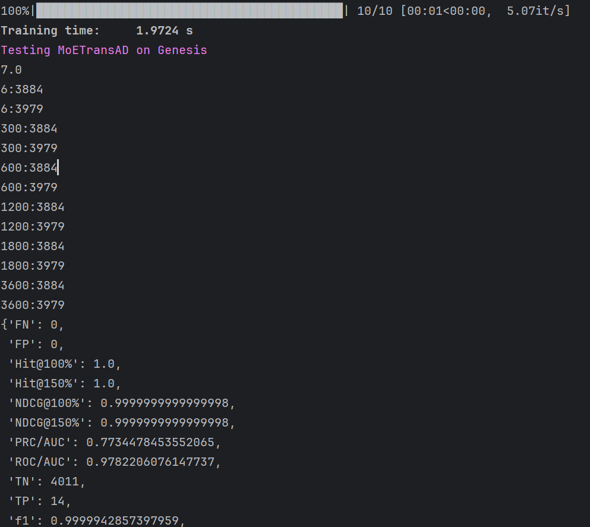

## Installation
This code needs Python-3.7 or higher.
## Dataset Preprocessing
```bash
python3 preprocess.py SMAP MSL SWaT SMD MBA PUMP Genesis GEC
```
## Result Reproduction
To run a model on a dataset, run the following command:
```bash
python main.py --model <model> --dataset <dataset> --retrain
```

